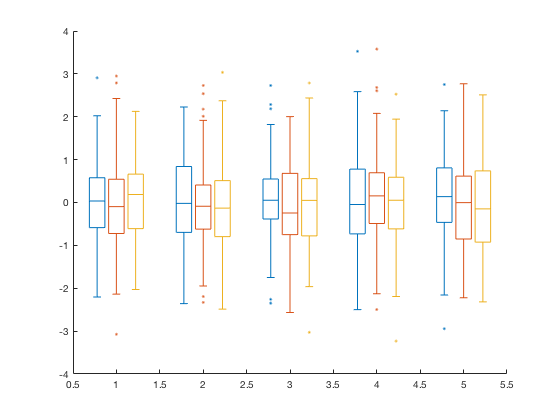

# boxplot2.m: Alternative Matlab boxplots
**Author: Kelly Kearney**


This repository includes the code for the `boxplot2.m` Matlab function, along with all dependent functions required to run it.  This function is intended as an alternative to the boxplot.m function that is included in the Statistics and Machine Learning Toolbox. 

The original boxplot.m function is more heavy-handed than most Matlab plotting functions; it replaces ticks with text labels, changes axis dimensions, etc. This version creates a boxplot with a minimal amount of alteration to existing axes, assuming that any cosmetic changes (color, tick labels, line specs, etc) can be added by the user afterwards if necessary.  

Additionally, this function allows one to create clustered boxplots, similar to an unstacked bar graph.  See below for an example.

## Getting Started

### Prerequisites

This software requires [Matlab](http://www.mathworks.com/products/matlab/) (tested primarily on R2012a-R2016a), as well as the [Statistics and Machine Learning Toolbox](http://www.mathworks.com/products/statistics/).

### Dowloading

Git users can clone (or fork, then clone) directly from this repository.

Alternatively, you may download a zipped version of this code either from this page or from the [boxplot2.m entry](http://www.mathworks.com/matlabcentral/fileexchange/59303-kakearney-boxplot2-pkg) on the MatlabCentral FileExchange. The File Exchange entry is updated daily from this repository.

### Installation

Once downloaded (and unzipped, if necessary), all subfolders in the main folder need to be added to your Matlab path:

```matlab
% Replace with location of the downloaded folder
pth = './boxplot2-pkg/';

addpath(fullfile(pth, 'boxplot2'); 
addpath(fullfile(pth, 'minmax'); 
```

## Usage

### Syntax

```
h = boxplot2(y)
h = boxplot2(y,x)
h = boxplot2(..., p1, v1, ...)
```

See standard function headers (accessed via `doc` or `help`) for a full description of input and output variables.

### Example

This example demonstrates how to create a simple grouped boxplot, and then to change some of the cosmetic details:

```matlab
% Data

x = 1:5;
y = randn(5, 3, 100);

% Plot boxplots

h = boxplot2(y,x);

% Alter linestyle and color

cmap = get(0, 'defaultaxescolororder');
for ii = 1:3
    structfun(@(x) set(x(ii,:), 'color', cmap(ii,:), ...
        'markeredgecolor', cmap(ii,:)), h);
end
set([h.lwhis h.uwhis], 'linestyle', '-');
set(h.out, 'marker', '.');
```



## Contributions

Community contributions to this package are welcome!

To report bugs, please submit an issue [here](https://github.com/kakearney/boxplot2-pkg/issues), and include:

- your operating system
- your version of Matlab and all relevant toolboxes (type `ver` at the Matlab command line to get this info)
- code/data to reproduce the error or buggy behavior, and the full text of any error messages received

Please also feel free to submit enhancement requests, or to send pull requests for bug fixes or new features.

I do monitor the MatlabCentral FileExchange entry for any issues raised in the comments, but would prefer to track issues here on GitHub.
